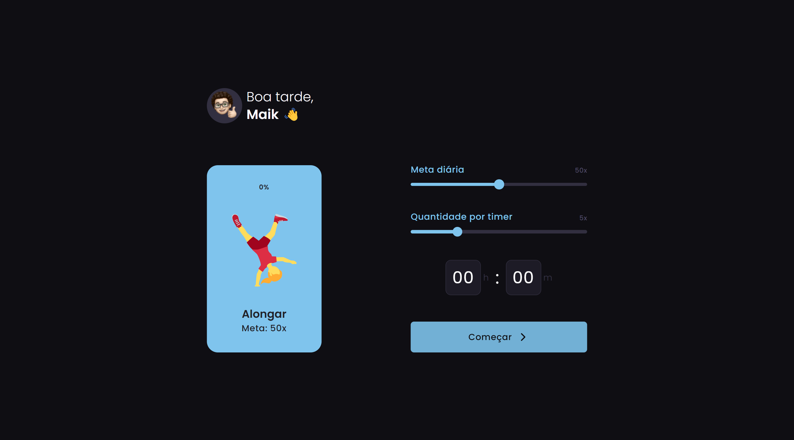

<h1 align="center"> Healthy Reminder - BoraCodar#35 </h1>

[Clique aqui para acessar](https://healthy-reminder.vercel.app/)

## 🚀 Tecnologias

Esse projeto foi desenvolvido com as seguintes tecnologias:

- [React](https://react.dev/)
- [Typescript](https://www.typescriptlang.org/)
- [Tailwind CSS](https://tailwindcss.com/)
- [iMask](https://www.npmjs.com/package/react-imask)
- Git and GitHub

## 💻 Projeto

O projeto "Healthy Reminder" oferece aos usuários a capacidade de definir metas diárias para atividades físicas, como exercícios e alongamentos, bem como especificar a quantidade a ser realizada em intervalos determinados. Com ele, você pode acompanhar e alcançar suas metas de forma fácil e eficaz para uma vida mais saudável.  

Projeto construído a partir do layout proposto no desafio [#BoraCodar35](https://boracodar.dev/) realizado pela [Rocketseat](https://rocketseat.com.br).
Após o desenvolvimento do projeto inicial, adicionei novas features, tais quais:

- Animações e efeitos hover/active;
- Opção de adicionar seu nome;
- Saudação personalizada (baseada na hora do dia);
- Informação do progresso das atividades;
- Visualização do tempo dos intervalos;
- Entre outras pequenas modificações.